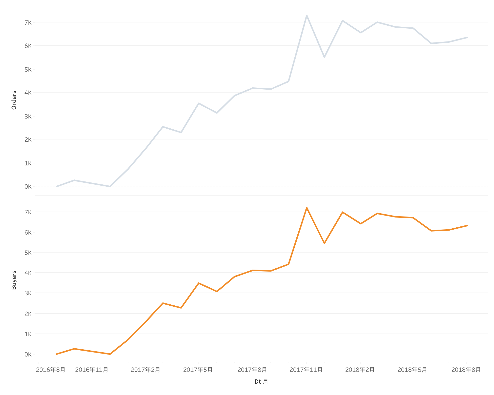
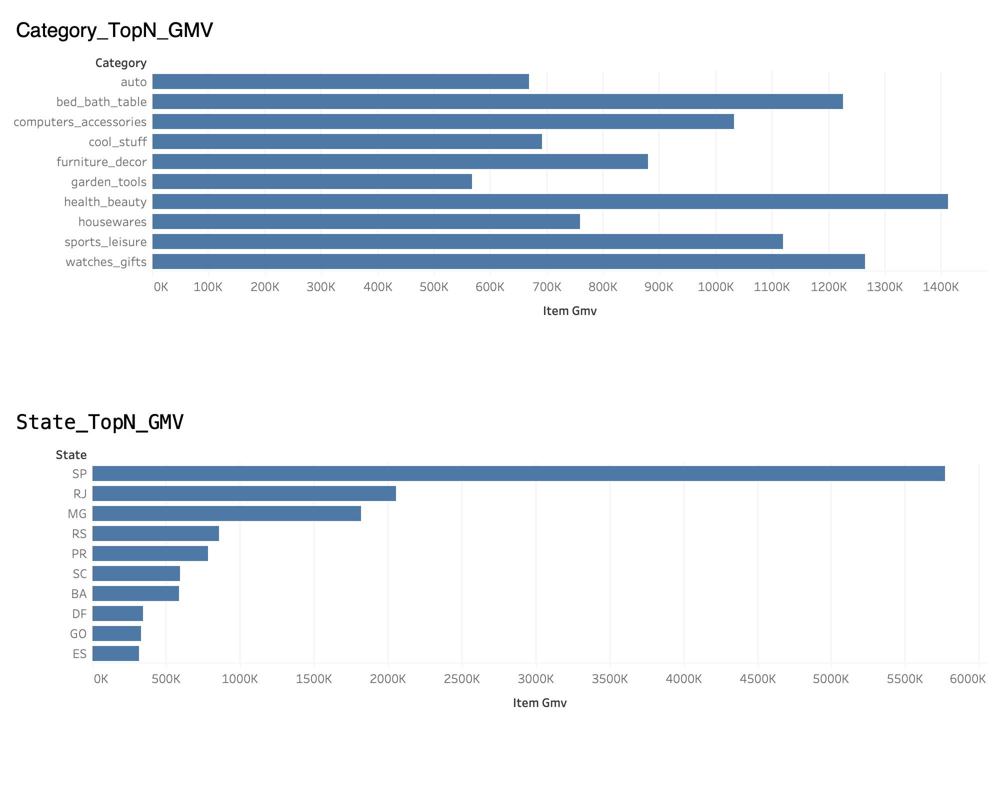
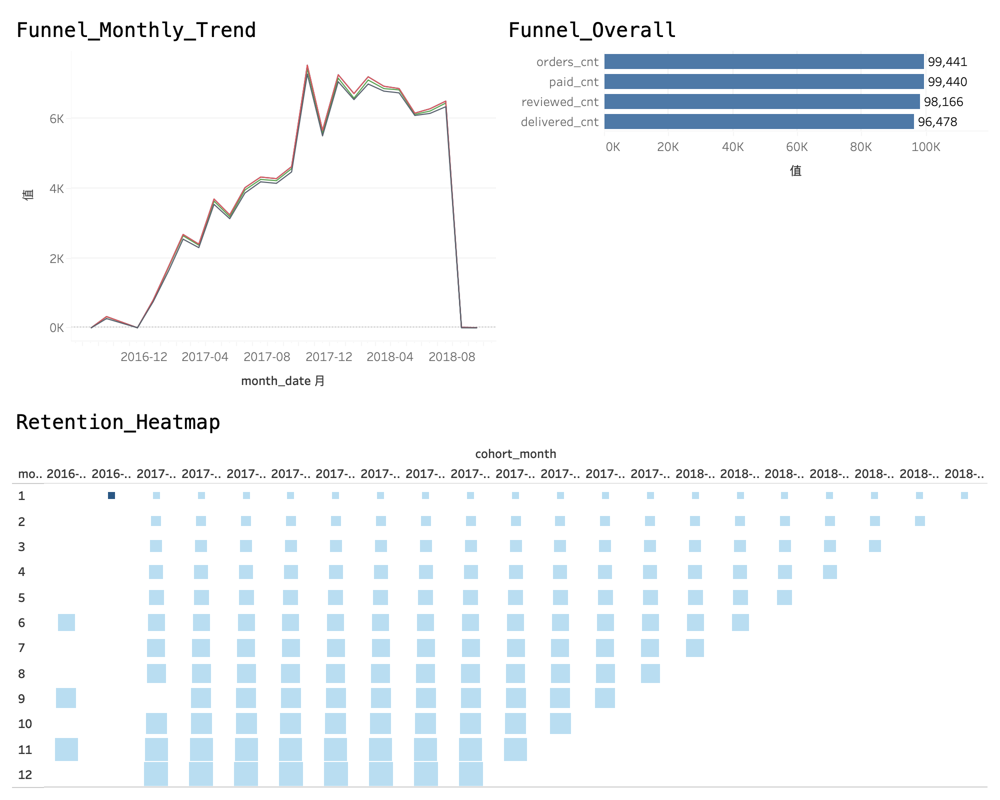
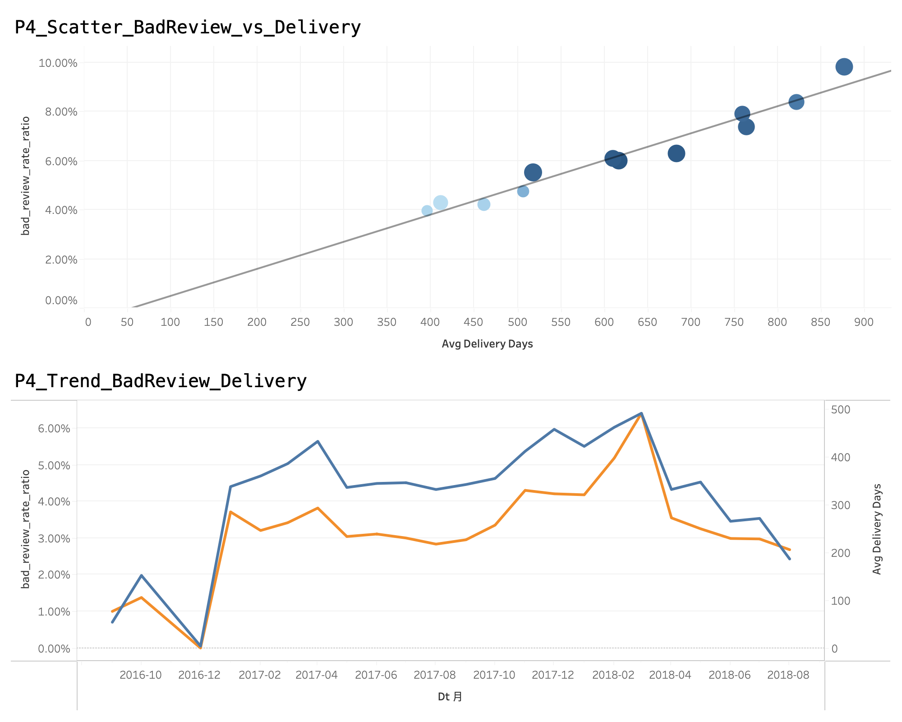
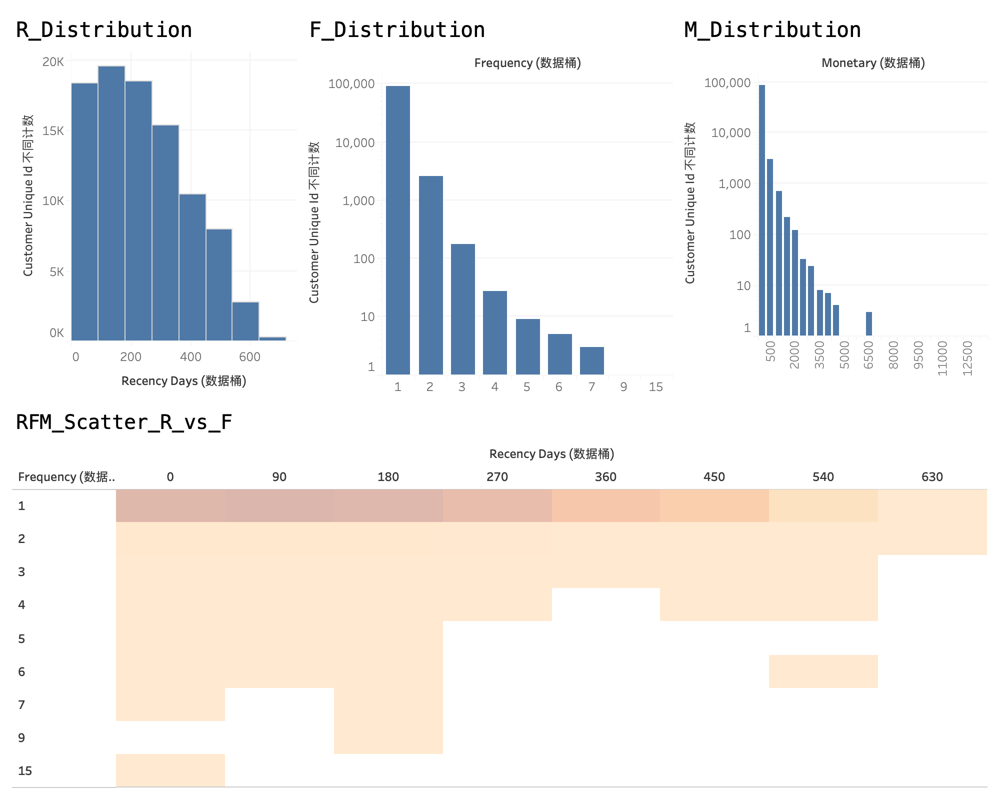

# Olist 电商经营分析

  

本项目基于公开的 Olist Brazilian E-Commerce 数据集，复现企业常见的数据分析全流程：

- 📊 **数据建模**: 星型模型设计，事实表 + 主题表
- 🔍 **指标体系**: GMV/订单/客单/复购/履约/体验指标
- 📈 **专题分析**: 留存 Cohort / 转化漏斗 / RFM 分层 / 根因分析
- 📉 **可视化看板**: Tableau 经营分析看板（全面版 5 页，仓库仅提交截图）
- 🐍 **Python 分析**: 数据质量检查、口径验证、特征工程

> 💡 **项目亮点**: 完整覆盖数据分析岗位核心技能 - SQL 建模、指标体系、BI 看板、专题分析、Python 数据处理

## ⭐ 核心结论

详见 1 页结论卡：[`docs/analysis_summary.md`](docs/analysis_summary.md)

- **漏斗**：下单 99,441 → 支付完成率 98.76% → 已送达 97.02% → 已评价 95.91%
- **体验**：延迟与差评强相关：延迟 0 天差评率 9.10%；延迟 1-3 天 31.50%；延迟 4-7 天 65.15%；延迟 8+ 天 76.62%
- **用户**：总用户数 93,358；复购用户数 1,693；复购率 1.81%（M1 留存 0.451%）

#### 全面版
- Page 1：经营总览（KPI + 趋势 + Top 类目/地区）
- Page 2：增长拆解与结构贡献（类目/地区贡献与风险叠加）
- Page 3：转化漏斗（下单→支付→发货→送达→评价）
- Page 4：履约与体验诊断（延迟分桶 vs 差评/评分，Top 问题来源）
- Page 5：用户留存与分层（Cohort 热力图 + RFM 分层）

截图建议保存到：
- `tableau/dashboard_screenshots/tableau_p1_overview.png`
- `tableau/dashboard_screenshots/tableau_p2_growth_drivers.png`
- `tableau/dashboard_screenshots/tableau_p3_funnel_retention.png`
- `tableau/dashboard_screenshots/tableau_p4_delivery_reviews.png`
- `tableau/dashboard_screenshots/tableau_p5_rfm.png`

| Page 1 | Page 2 |
|---|---|
|  |  |

| Page 3 | Page 4 |
|---|---|
|  |  |

| Page 5 |
|---|
|  |

---

## 🎯 项目目标

通过真实电商数据集，展示以下能力：
- ✅ 数据建模与 ETL 流程设计
- ✅ 业务指标体系搭建与口径管理
- ✅ 多维度数据分析与洞察挖掘
- ✅ 可视化看板设计与交互实现
- ✅ 数据驱动的业务建议输出

---

## 📁 项目结构

```
olist_analytics/
├── 📄 README.md                    # 项目主文档
├── 📄 requirements.txt             # Python 依赖
├── 📄 .gitignore                   # Git 配置
│
├── 📁 archive/                     # 原始数据（不提交到 Git）
│   └── *.csv                       # Olist 数据集（9个文件）
│
├── 📁 data/                        # 数据处理
│   ├── raw/                        # 原始数据备份
│   └── processed/                  # 处理后数据
│
├── 📁 sql/                         # SQL 脚本
│   ├── 00_setup/                   # 建库建表与导入
│   │   ├── 01_create_tables.sql    # 建表
│   │   └── 02_load_data.sql        # 导入
│   ├── 10_model/                   # 数仓模型（事实表/主题表）
│   │   ├── 03_build_fact.sql       # 事实表
│   │   └── 04_build_dm.sql         # 主题表
│   └── 20_analysis/                # 专题分析
│       ├── 05_cohort_retention.sql # 留存分析
│       └── 06_funnel_analysis.sql  # 转化漏斗
│
├── 📁 notebooks/                   # Python 分析
│   └── 01_data_quality_checks.ipynb
│
├── 📁 scripts/                     # 自动化脚本
│   └── quick_start.sh              # 快速启动
│
├── 📁 results/                     # 查询结果输出
│
├── 📁 reports/                     # 分析报告
│   └── analysis_report.md
│
├── 📁 tableau/                     # Tableau 截图交付物
│   └── dashboard_screenshots/
│
└── 📁 docs/                        # 文档
    ├── metric_dict.md              # 指标口径
    ├── analysis_summary.md         # 分析报告
    ├── RESUME_TEMPLATE.md          # 简历写法参考
    ├── guides/                     # 指南文档
    │   ├── START_HERE.md           # 🌟 新手入门（必读）
    │   ├── PROJECT_ROADMAP.md      # 项目路线图
    │   ├── GITHUB_SETUP.md         # GitHub 指南
    │   └── DIRECTORY_STRUCTURE.md  # 目录说明
    └── screenshots/                # 截图
        ├── tableau/                # BI 看板截图
        └── sql_results/            # SQL 结果截图
```

> 💡 **新手入门**: 请先阅读 [docs/guides/START_HERE.md](docs/guides/START_HERE.md)，这是一份完整的 10 天实施指南！

---

## 🛠️ 技术栈

| 类别 | 技术 | 用途 |
|------|------|------|
| 数据库 | MySQL 8.x | 数据存储与建模 |
| 查询语言 | SQL | 数据提取、转换、分析 |
| 可视化 | Tableau | 交互式看板 |
| 编程语言 | Python 3.8+ | 数据清洗、验证、分析 |
| 核心库 | pandas, numpy, matplotlib | 数据处理与可视化 |

---

## 📊 数据来源

**Olist Brazilian E-Commerce Public Dataset** (Kaggle)
- 📦 约 100,000 订单（2016-2018）
- 📋 8+ 张关联表（订单、商品、支付、评价等）
- 🔗 [数据集下载地址](https://www.kaggle.com/olistbr/brazilian-ecommerce)

> ⚠️ **注意**: 出于仓库体积考虑，本仓库不包含原始 CSV 数据。请自行下载并放入 `archive/` 目录。

---

## 🚀 快速开始

### 方法一：使用自动化脚本

```bash
# 1. 下载数据集到 archive/ 目录
# 2. 运行快速启动脚本
./scripts/quick_start.sh
```

脚本会自动完成：
- ✅ 创建 Python 虚拟环境
- ✅ 安装依赖包
- ✅ 导入数据到 MySQL
- ✅ 构建事实表和主题表
- ✅ 启动 Jupyter Notebook

### 方法二：手动步骤

#### 1️⃣ 准备数据
```bash
# 从 Kaggle 下载数据集并解压到 archive/ 目录
# 确认包含以下文件：
ls archive/
# olist_orders_dataset.csv
# olist_order_items_dataset.csv
# olist_order_payments_dataset.csv
# olist_customers_dataset.csv
# olist_order_reviews_dataset.csv
# olist_products_dataset.csv
# olist_sellers_dataset.csv
# product_category_name_translation.csv
```

#### 2️⃣ 导入数据库
```bash
# 建表
mysql --local-infile=1 -u root -p < sql/00_setup/01_create_tables.sql

# 导入数据
mysql --local-infile=1 -u root -p < sql/00_setup/02_load_data.sql

# 构建事实表
mysql --local-infile=1 -u root -p < sql/10_model/03_build_fact.sql

# 构建主题表
mysql --local-infile=1 -u root -p < sql/10_model/04_build_dm.sql
```

#### 3️⃣ 运行 Python 分析
```bash
# 创建虚拟环境
python3 -m venv venv
source venv/bin/activate

# 安装依赖
pip install -r requirements.txt

# 启动 Jupyter
jupyter notebook notebooks/
```

#### 4️⃣ 连接 Tableau
- 连接到 MySQL 数据库
- 使用 `dm_*` 主题表（性能更好）
- 创建三页看板（见下文）

---

## 📈 核心分析模块

### 1. 指标体系

| 指标类别 | 核心指标 | 说明 |
|---------|---------|------|
| 规模指标 | GMV、订单数、买家数 | 业务规模监控 |
| 效率指标 | 客单价、复购率 | 运营效率评估 |
| 体验指标 | 准时率、差评率、平均评分 | 用户体验监控 |
| 履约指标 | 发货时长、配送时长 | 物流效率分析 |

**指标口径**（重要）:
- **有效订单**: 仅统计 `order_status = 'delivered'`
- **item_gmv**: `sum(price + freight_value)` - 主口径，适合经营分析
- **paid_gmv**: `sum(payment_value)` - 对账口径，支付流水视角

详见: [指标口径文档](docs/metric_dict.md)

### 2. 专题分析

#### 📊 Cohort 留存分析
- 首购月 Cohort 定义
- 后续月份复购率计算
- 留存热力图可视化

```sql
-- 执行留存分析
mysql -u root -p < sql/20_analysis/05_cohort_retention.sql
```

#### 🔄 转化漏斗分析
- 下单 → 支付 → 发货 → 送达 → 评价
- 各环节转化率与流失率
- 按品类/时间维度对比

```sql
-- 执行漏斗分析
mysql -u root -p < sql/20_analysis/06_funnel_analysis.sql
```

#### 👥 RFM 用户分层
- Recency（最近购买）
- Frequency（购买频次）
- Monetary（消费金额）
- 8 类用户分层与策略建议

```sql
-- RFM 结果已在主题表中
SELECT * FROM db_olist.dm_customer_rfm LIMIT 10;
```

### 3. Tableau 看板设计

#### Page 1: 经营总览
- **KPI 卡片**: GMV、订单数、客单价、复购率、差评率
- **趋势图**: 按月 GMV/订单趋势
- **Top 排行**: Top 10 品类、Top 10 地区
- **切片器**: 时间、地区、品类

#### Page 2: 增长与用户
- **新老客对比**: 新客/老客 GMV 贡献
- **Cohort 热力图**: 首购月留存矩阵
- **RFM 分层**: 用户分层分布与价值贡献
- **用户画像**: 高价值用户特征

#### Page 3: 履约与体验
- **物流链路**: 发货时长、配送时长分布
- **准时率分析**: 按地区/品类准时率对比
- **评分关联**: 履约时长 vs 评分散点图
- **异常定位**: 差评 Top 品类/卖家

---

## 📝 分析报告示例

基于数据分析，输出以下结论与建议：

### 核心发现
1. **GMV 趋势**: 2017 年呈现稳定增长，Q4 季节性明显
2. **品类结构**: Top 3 品类贡献 45% GMV，但差评率偏高
3. **履约问题**: 平均到货时长 12 天，超时订单差评率高 2.3 倍
4. **用户价值**: 高价值用户仅占 8%，但贡献 35% GMV

### 优化建议
1. **履约优化**: 重点优化高差评品类的物流时效
2. **用户运营**: 对高潜用户进行定向触达，提升复购
3. **体验监控**: 建立差评预警机制，及时干预

完整报告见: [分析报告](docs/analysis_summary.md)

---

## 🎓 技能展示

通过本项目，可以向面试官展示：

| 技能领域 | 具体能力 | 项目体现 |
|---------|---------|---------|
| **SQL** | 多表关联、窗口函数、复杂聚合 | 留存 Cohort、漏斗分析 SQL |
| **数据建模** | 星型模型、事实表/维度表设计 | fact_orders + dm_* 主题表 |
| **指标体系** | KPI 拆解、口径管理 | metric_dict.md 指标文档 |
| **BI 工具** | Tableau 看板设计 | 交互式经营分析看板 |
| **Python** | pandas 数据处理、质量检查 | 数据质量检查 Notebook |
| **业务分析** | 留存/漏斗/RFM/根因分析 | 专题分析 SQL + 报告 |
| **文档能力** | 技术文档、分析报告撰写 | README + 分析报告 |

---

## 📦 交付物清单

- ✅ **数据模型**: 星型模型设计，事实表 + 5 张主题表
- ✅ **SQL 脚本**: 6+ 个专题分析脚本（可复用、可复查）
- ✅ **指标文档**: 完整的 KPI 定义与口径说明
- ✅ **BI 看板**: Tableau 看板（全面版 5 页，仓库仅提交截图）
- ✅ **Python 分析**: 数据质量检查 + 特征工程 Notebook
- ✅ **分析报告**: 业务结论 + 优化建议（PDF）
- ✅ **项目文档**: 完整的 README + 复现步骤

---

## 🔧 常见问题

### Q1: MySQL 导入数据失败？
**A**: 检查以下几点：
- 确认 `local_infile` 已启用: `SET GLOBAL local_infile = 1;`
- 检查文件路径是否正确（绝对路径）
- 确认文件编码为 UTF-8
- 检查 MySQL 用户权限

### Q2: Tableau 无法连接 MySQL？
**A**: 
- 确认 MySQL 服务正在运行
- 安装 MySQL 驱动（按 Tableau 官方文档选择对应版本）
- 检查连接字符串格式
- 确认防火墙设置

### Q3: Python 依赖安装失败？
**A**:
```bash
# 升级 pip
pip install --upgrade pip

# 使用国内镜像源
pip install -r requirements.txt -i https://pypi.tuna.tsinghua.edu.cn/simple
```

### Q4: 如何导出 Tableau 看板截图？
**A**:
- 在 Tableau 中打开仪表盘
- 使用截图工具（macOS: Cmd+Shift+4）
- 或导出为 PDF/图片

---

## 📚 学习资源

- [MySQL 官方文档](https://dev.mysql.com/doc/)
- [Tableau 教程](https://www.tableau.com/learn)
- [pandas 文档](https://pandas.pydata.org/docs/)
- [Kaggle Olist 数据集](https://www.kaggle.com/olistbr/brazilian-ecommerce)

---

## 🤝 贡献与反馈

如果你有任何建议或发现问题，欢迎：
- 提交 Issue
- 发起 Pull Request
- 联系作者交流

---

## 📄 License

本项目仅用于学习与作品展示。数据集版权归 Olist 所有。

---

## 🌟 致谢

- 感谢 Olist 提供公开数据集
- 感谢 Kaggle 平台
- 参考了多个开源项目的最佳实践

---
